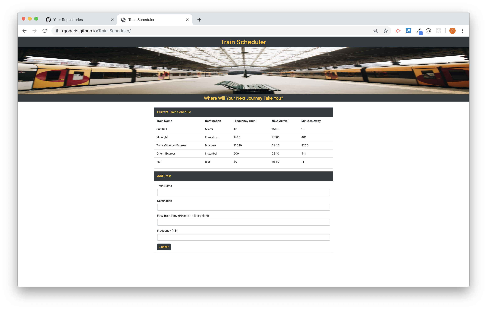

# Train Scheduler
Firebase Train Scheduler

Train Scheduler is a app that allows the user to input and view train times.  When visiting the site a user can submit a train name, train destination, first train time, and train frequency.  This information is saved to a firebase database and rendered to the page displaying the train name and destination.  In addition to this a JavaScript algorithim calculates the next train time and minutes away based on the frist train time, frequency, and the current time.  Moment.js is utilized for all date/time cleanup and calculations.

### Train Scheduler View

[Train Scheduler](https://rgoderis.github.io/Train-Scheduler/)